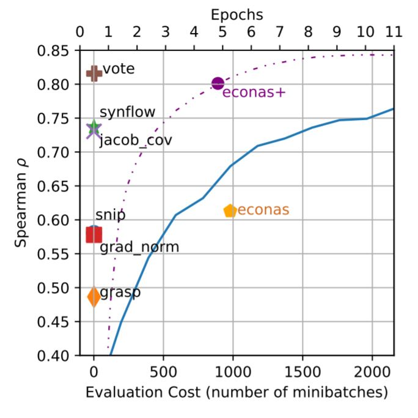
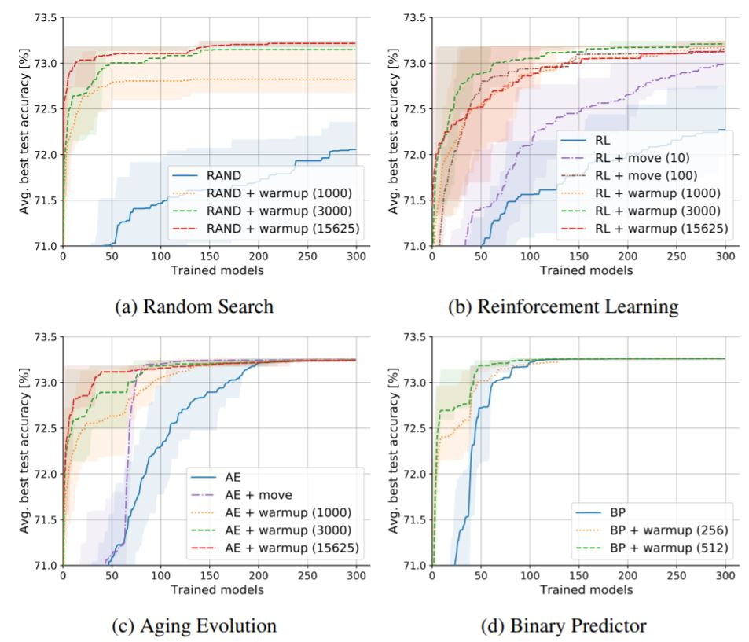

# Zero-Cost-NAS
Companion code for the ICLR2021 paper: [Zero-Cost Proxies for Lightweight NAS](https://openreview.net/forum?id=0cmMMy8J5q)    
**tl;dr A single minibatch of data is used to score neural networks for NAS instead of performing full training.**

In this README, we provide:
- [Summary of our work](#Summary)
- [How to run the code](#Running-the-Code)
  - [API](#API)
  - [Reproducing results on NAS benchmrks](#Reproducing-Results)
  - [Incorporate with NAS algorithms](#NAS-with-Zero-Cost-Proxies)

**If you have any questions, please open an issue or email us.** (last update: 02.02.2021)

## Summary

**Intro.** To perform neural architecture search (NAS), deep neural networks (DNNs) are typically trained until a final validation accuracy is computed and used to compare DNNs to each other and select the best one.
However, this is time-consuming because training takes multiple GPU-hours/days/weeks.
This is why a _proxy_ for final accuracy is often used to speed up NAS.
Typically, this proxy is a reduced form of training (e.g. EcoNAS) where the number of epochs is reduced, a smaller model is used or the training data is subsampled.

**Proxies.** Instead, we propose a series of "zero-cost" proxies that use a single-minibatch of data to score a DNN.
These metrics are inspired by recent pruning-at-initialization literature, but are adapted to score an entire DNN and work within a NAS setting.
When compared against `econas` (see orange pentagon in plot below), our zero-cost metrics take ~1000X less time to run but are better-correlated with final validation accuracy (especially `synflow` and `jacob_cov`), making them better (and much cheaper!) proxies for use within NAS.
Even when EcoNAS is tuned specifically for NAS-Bench-201 (see `econas+` purple circle in the plot), our `vote` zero-cost proxy is still better-correlated and is 3 orders of magnitude cheaper to compute.

_Figure 1: Correlation of validation accuracy to final accuracy during the first 12 epochs of training (blue line) for three CIFAR-10 on the NAS-Bench-201 search space. Zero-cost and EcoNAS proxies are also labeled for comparison._



**Zero-Cost NAS** We use the zero-cost metrics to enhance 4 existing NAS algorithms, and we test it out on 3 different NAS benchmarks. For all cases, we achieve a new SOTA (state of the art result) in terms of search speed. We incorporate zero-cost proxies in two ways: (1) warmup: Use proxies to initialize NAS algorithms, (2) move proposal: Use proxies to improve the selection of the next model for evaluation. As Figure 2 shows, there is a significant speedup to all evaluated NAS algorithms. 

_Figure 2: Zero-Cost warmup and move proposal consistently improves speed and accuracy of 4 different NAS algorithms._



For more details, please take a look at our [paper](https://openreview.net/pdf?id=0cmMMy8J5q)!

## Running the Code

- Install [PyTorch](https://pytorch.org/) for your system (v1.5.0 or later).
- Install the package: `pip install .` (add `-e` for editable mode) -- note that all dependencies other than pytorch will be automatically installed.

### API

The main function is `find_measures` below. Given a neural net and some information about the input data (`dataloader`) and loss function (`loss_fn`) it returns an array of zero-cost proxy metrics.

```python
def find_measures(net_orig,                  # neural network
                  dataloader,                # a data loader (typically for training data)
                  dataload_info,             # a tuple with (dataload_type = {random, grasp}, number_of_batches_for_random_or_images_per_class_for_grasp, number of classes)
                  device,                    # GPU/CPU device used
                  loss_fn=F.cross_entropy,   # loss function to use within the zero-cost metrics
                  measure_names=None,        # an array of measure names to compute, if left blank, all measures are computed by default
                  measures_arr=None):        # [not used] if the measures are already computed but need to be summarized, pass them here
```

The available zero-cost metrics are in the [measures](foresight/pruners/measures) directory. You can add new metrics by simply following one of the examples then registering the metric in the [load_all](https://github.sec.samsung.net/mohamed1-a/foresight-nas/blob/29ec5ad17496fb6bb24b27dbc782db1615214b0f/foresight/pruners/measures/__init__.py#L35) function. More examples of how to use this function can be found in the code to reproduce results (below). You can also modify data loading functions in [p_utils.py](foresight/pruners/p_utils.py)

### Reproducing Results

#### NAS-Bench-201

1. Download the [NAS-Bench-201 dataset](https://drive.google.com/open?id=1SKW0Cu0u8-gb18zDpaAGi0f74UdXeGKs) and put in the `data` directory in the root folder of this project.
2. Run python `nasbench2_pred.py` with the appropriate cmd-line options -- a pickle file is produced with zero-cost metrics (see `notebooks` folder on how to use the pickle file.
3. Note that you need to manually download [ImageNet16](https://drive.google.com/drive/folders/1NE63Vdo2Nia0V7LK1CdybRLjBFY72w40?usp=sharing) and put in `_datasets/ImageNet16` directory in the root folder. CIFAR-10/100 will be automatically downloaded.

#### NAS-Bench-101

1. Download the [`data` directory](https://drive.google.com/drive/folders/18Eia6YuTE5tn5Lis_43h30HYpnF9Ynqf?usp=sharing) and save it to the root folder of this repo. This contains pre-cached info from the NAS-Bench-101 repo.
2. [Optional] Download the [NAS-Bench-101 dataset](https://storage.googleapis.com/nasbench/nasbench_only108.tfrecord) and put in the `data` directory in the root folder of this project and also clone the [NAS-Bench-101 repo](https://github.com/google-research/nasbench) and install the package.
3. Run `python nasbench1_pred.py`. Note that this takes a long time to go through ~400k architectures, but precomputed results are in the `notebooks` folder (with a link to the [results](https://drive.google.com/drive/folders/1fUBaTd05OHrKIRs-x9Fx8Zsk5QqErks8?usp=sharing)).

#### PyTorchCV

1. Run python `ptcv_pred.py`

#### NAS-Bench-ASR

Coming soon...

### NAS with Zero-Cost Proxies

For the full list of NAS algorithms in our paper, we used a different NAS tool which is not publicly released. However, we included a notebook [`nas_examples.ipynb`](notebooks/nas_examples.ipynb) to show how to use zero-cost proxies to speed up aging evolution and random search methods using both warmup and move proposal.

## Citation

```
@inproceedings{
  abdelfattah2021zerocost,
  title={{Zero-Cost Proxies for Lightweight NAS}},
  author={Mohamed S. Abdelfattah and Abhinav Mehrotra and {\L}ukasz Dudziak and Nicholas D. Lane},
  booktitle={International Conference on Learning Representations (ICLR)},
  year={2021}
}
```
